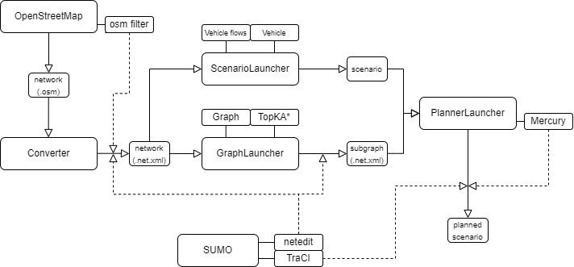

<div id="top"></div>


<!-- PROJECT LOGO -->
<br />
<div align="center">
  <h3 align="center">Urban Traffic Control</h3>

  <p align="center">
    Extension of bachelor thesis project: connecting automated planning with SUMO simulator
  </p>
</div>


<!-- TABLE OF CONTENTS -->
<details>
  <summary>Table of Contents</summary>
  <ol>
    <li>
      <a href="#about-the-project">About The Project</a>
      <ul>
        <li><a href="#built-with">Built With</a></li>
      </ul>
    </li>
    <li>
      <a href="#getting-started">Getting Started</a>
      <ul>
        <li><a href="#prerequisites">Prerequisites</a></li>
        <li><a href="#installation">Installation</a></li>
      </ul>
    </li>
   <li>
      <a href="#scenario">Traffic Scenario</a>
    </li>
    <li>
      <a href="#usafe">Usage</a>
      <ul>
        <li><a href="#description">Description</a></li>
        <li><a href="#classes">Classes</a></li>
        <li><a href="#example">Example</a></li>
      </ul>
    </li>
  </ol>
</details>


<!-- ABOUT THE PROJECT -->
## About The Project

This project is extension of previous version (bachelor thesis): https://github.com/Matyxus/UTC, 
project can be described with the following flow diagram and <a href="#example">example</a> of how to use the project
is provided.



<p align="right">(<a href="#top">back to top</a>)</p>

### Built With

* [gcc]() / [g++]()
* [python3.9]()
* [Cmake]() / [Make]() (for planner installation)

Python libraries: (version can be found in [requirements.txt](/requirements.txt) file)
* [pip](https://pypi.org/project/pip/)
* [wheel](https://pypi.org/project/wheel/)
* [setuptools](https://pypi.org/project/setuptools/)
* [numpy](https://numpy.org/)
* [matplotlib](https://matplotlib.org/)
* [prompt_toolkit](https://python-prompt-toolkit.readthedocs.io/en/master/)
* [traci](https://pypi.org/project/traci/)
* [sumolib](https://pypi.org/project/sumolib/)

<p align="right">(<a href="#top">back to top</a>)</p>


<!-- GETTING STARTED -->
## Getting Started

To get a local copy up and running follow these example steps.

### Prerequisites


1) [osmfilter.c](https://wiki.openstreetmap.org/wiki/Osmfilter) (located in UTC/utc/data/osm_filter) has to be compiled
  ```sh
  gcc osmfilter.c -O3 -o osmfilter
  ```
2) [SUMO](https://www.eclipse.org/sumo/) has to be downloaded and installed along with SUMO_PATH
3) [Planner](https://ipc2018-classical.bitbucket.io/#description) 
used in this project: [Mercury](https://helios.hud.ac.uk/scommv/IPC-14/errPlan.html) (agile)

### Installation

1. Clone the repo
   ```sh
   git clone https://github.com/Matyxus/UTC-v2
   ```
2. In folder where UTC-v2 is located execute:
   ```sh
   pip install -e UTC-v2
   ```
3. Install requirements (in ../UTC-v2)
   ```sh
   pip install -r requirements.txt
   ```
4. Compile planners (expected [IPC](https://www.icaps-conference.org/competitions/) 
standard as input -> domain, problem file, result file)
5. Give permission to project enabling it to create, delete: folders, files and execute
commands with [subprocess](https://docs.python.org/3/library/subprocess.html) library.
6. Execute UTC-v2/utc/test/test_launcher.py for testing the whole project (checks for missing folders etc.)

<p align="right">(<a href="#top">back to top</a>)</p>

<!-- Scenario -->
## Traffic Scenario
SUMO's scenarios consist of following files:
1. ".sumocfg" file (which runs the simulation in SUMO GUI, references other files)
2. ".rou.xml" file (file containing vehicle routes)
3. ".add.xml" file (additional file type, contains vehicles etc.)
5. Optional files:  
   1. ".stat.xml" file (contains vehicle statistics, average values of speed, delay, etc.)
   2. ".pddl" problem file (contains the scenario represented in pddl format)
   3. ".pddl" result file (contains the action of objects from pddl problem files, generated by planner)
   4. ".log" file (contains the logging output)
   5. ".json" files (can contain configuration used for this scenario, vehicle statistics, etc.)
   
Scenarios structure is following (located in [data folder](./utc/data/scenarios)):
```
[scenario]
   └─── additional (contains files associated with ".sumocfg" input -> routes, vehicles, ...)
   └─── config (contains "[scenario].sumocfg" files (usually only single))  
   └─── info (contains confugration of scenario, logging output, etc.) 
   └─── problems* (contains pddl problem files)
   └─── results* (contains results of planner)
   └─── stats* (contains statistics of scenario)
   └─── output* (contains output of planners)

Note: [scenario] is name chosen by user (when generating
planned scenario, new [scenario] name is given by user).
All scenarios have unique name, since it is used as "name-space",
referencing to similary named files e.g. "[scenario].rou.xml", "[scenario].stat.xml", etc...
* Folders denoted by star (*) are created only when their content is created / needed.
```
<p align="right">(<a href="#top">back to top</a>)</p>

<!-- USAGE EXAMPLES -->
## Usage

Interaction with the project is defined trough command line by passing pre-defined configuration files, which
the user can modify. These configuration files are loaded at the start of the program into global memory and then into
specific [data classes](https://docs.python.org/3/library/dataclasses.html). Data classes all automatically validating
the given input with [json schema](https://python-jsonschema.readthedocs.io/en/stable/), so that any invalid
types / values and arguments can be detected before the program starts running. All data classes also define default values
for all parameters that do not have to be set by user (logging, TopKA*, DBSCAN, ...).

### Description

### Classes

There are 6 sub-packages in the project:
1. [Clustering](./utc/src/clustering) implements gravitational & similarity clustering
2. [Constants](./utc/src/constants) contains global constants, including file system
3. [Graph](./utc/src/graph) models the road network as graph, contains visualization, TopKA* and other algorithms
4. [Pddl](./utc/src/routing) responsible for planning scenarios
5. [Simulator](./utc/src/simulator) provides support for SUMO's traci and traffic scenarios
6. [Utils](./utc/src/utils) utility method and classes such as [Converter](./utc/src/utils/converter.py) which converts ".osm" files into SUMO's ".net.xml" and others

More in depth explanation of each package can be found in their respective folders, which contain "readme" files.

### Example

1. Download maps from [OpenStreetMap](https://www.openstreetmap.org/). \
Save them in [UTC/utc/data/maps/osm](./utc/data/maps/osm) folder.
2. Convert downloaded maps into '.net.xml' format using [Converter](./utc/src/converter).
3. Generate scenario using [ScenarioMain](./utc/src/simulator). 
4. (Optional) Generate sub-graph for road network used in scenario using [GraphMain](./utc/src/graph). \
Planners can take long time to generate solutions if road network (or number of cars)
is large, for that reason it is advantageous to use smaller networks (sub-graphs).
5. Generate planned scenario using [UtcLauncher](utc/src/routing/utc_problem).
6. Launch scenario and compare vehicle statistics against planned simulation using [ScenarioMain](./utc/src/simulator).

<p align="right">(<a href="#top">back to top</a>)</p>