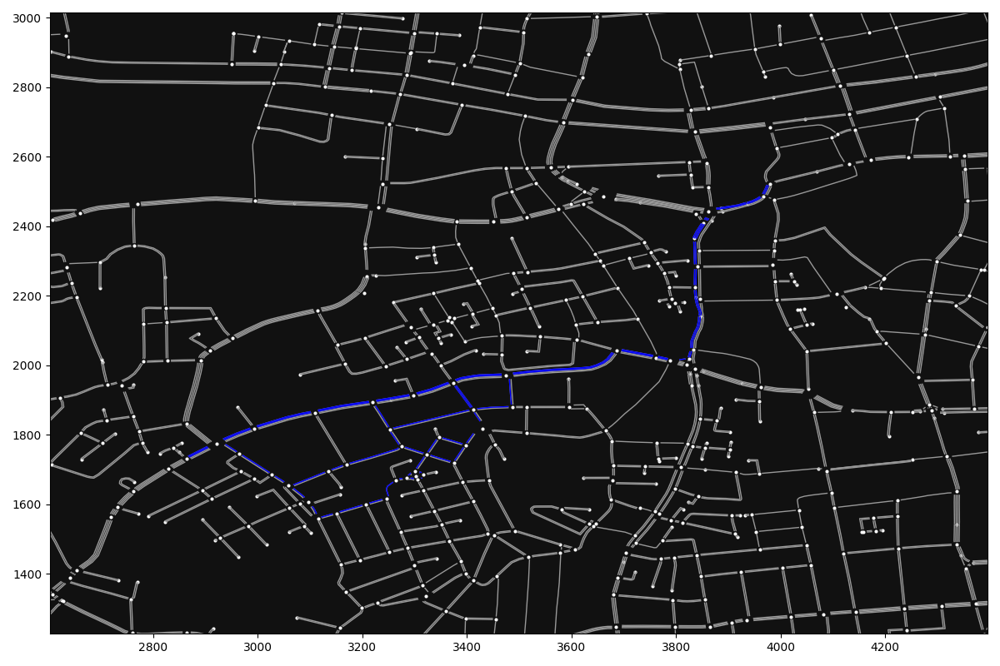
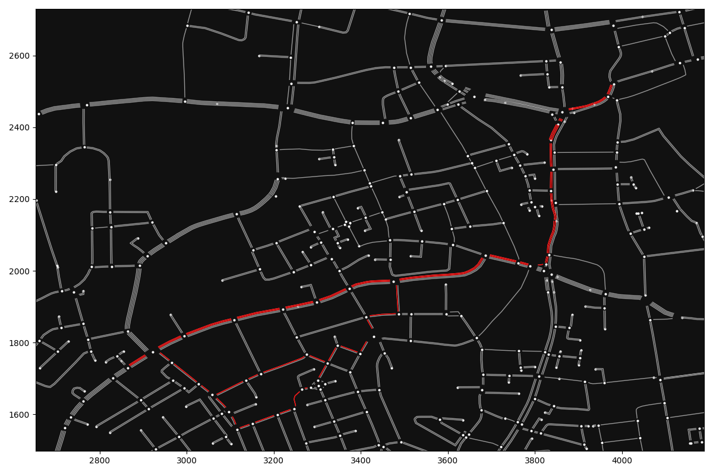

<div id="top"></div>


<!-- PROJECT LOGO -->
<br />
<div align="center">
  <h3 align="center">Clustering Methods</h3>

  <p align="center">
    Gravitational clustering and Similarity based clustering (DBSCAN).
  </p>
</div>


<!-- TABLE OF CONTENTS -->
<details>
  <summary>Table of Contents</summary>
  <ol>
    <li>
      <a href="#about-the-package">About The Package</a>
    </li>
    <li>
      <a href="#usage">Usage</a>
    </li>
    <li>
      <a href="#gravitational-clustering">Gravitational clustering</a>
        <ul>
            <li><a href="#parameters1">Parameters</a></li>
            <li><a href="#example1">Example</a></li>
        </ul>
    </li>
    <li>
      <a href="#similarity-clustering">Similarity clustering</a>
        <ul>
            <li><a href="#parameters2">Parameters</a></li>
            <li><a href="#example2">Example</a></li>
        </ul>
    </li>
  </ol>
</details>


<!-- ABOUT THE PACKAGE -->
## About The Package

This package implements two clustering methods, Gravitational clustering, which identifies "problematic" regions in road
networks based on SUMO's simulation data of vehicles. Similarity based clustering, which uses 
[Jaccard Index](https://en.wikipedia.org/wiki/Jaccard_index) to measure route similarity against all other routes and clustering
based on this similarity is done by algorithm [DBSCAN](https://scikit-learn.org/dev/auto_examples/cluster/plot_dbscan.html).

<!-- USAGE EXAMPLES -->
## Usage

To use Gravitational clustering 3 files are required:
1) Configuration file with all parameters (JSON), example can be found in [data](../../data/config/clustering_lust_config.json) directory.
2) Historical (statical) data of SUMO's simulation, so called [edge data dump](https://sumo.dlr.de/docs/Simulation/Output/Lane-_or_Edge-based_Traffic_Measures.html)
3) Road network from which the data originated

Similarity clustering cannot be used directly, as it requires array of routes, which must first be generated, that can for example be done 
by [TopKA*](../graph/modules/path_finder.py) algorithm. More in-detail description can be found below.

## Gravitational clustering

### Parameters

There are in total 11 options, 4 of these used for visualization:
1) Data path: absolute path to the edge data (dump) file.
2) Network: name (must be in [maps/sumo](../../data/maps/sumo) directory, or full path) to the road network edge data originated from.
3) Multiplier: weight (CI) multiplier for faster (less accurate) convergence (higher than 1)
4) Start time: of interval in the edge data file (in seconds, cannot be lower than 0)
5) End time: of interval in the data file (in seconds, can be 'None' / 'Null' in which case there is no limit)
6) Iterations: number of iterations the algorithm should do (will still end sooner, if merging finished before).
7) Merging radius: the minimal distance between points (clusters) that causes them to be merged.

Additional plotting options:
1) Frequency: how often should plots be shown (0 for never).
2) Heatmap: boolean value which turns on plotting of heatmap of CI.
3) Planets: boolean value which turns on plotting of "planets" i.e. individual clusters (depicted as points), 
which size depends on the cluster weight.
4) Cluster size: minimal number of points in cluster to be considered for plotting.

### Example
``` shell
python grav_clustering_options.py -c [config]
```
Configuration file if used strictly as only name of the file (without extension) must be located in [config](../../data/config) directory,
otherwise full path is required, make note that the parameters must satisfy the JSON [schema](../../data/templates/json/GravClusteringOptions.json)
and other requirements described above.

<p align="right">(<a href="#top">back to top</a>)</p>

## Similarity clustering

### Parameters

There are in total 5 parameters:
1) Epsilon: minimal similarity between two routes for them to be added into same cluster.
2) Minimum samples: minimal amount of routes similar enough to be considered cluster.
3) Min routes: minimal amount of routes to be considered for clustering.
4) Metric: by which the clusters are sorted, described below in more detail.
5) K: the total number of routes to be returned after sorting clusters by metric. 
If value is between 0 and 1, it is considered as percentage.

There are 3 (5) metrics:
1) Average similarity (dissimilarity): computes the averages between all routes in clusters and finally for the
cluster itself, then sorts by these values.
2) Minimal (maximal) similarity: ranks routes in cluster based on average similarity to all other cluster routes.
3) Shortest length: sorts routes by their length (if routes were found by [TopKA*](../graph/modules/path_finder.py) it is not needed).

### Example
As said above, Similarity clustering cannot be used by itself, therefore a simple example is provided to showcase
its usage.
```python
# To use Similarity metric, custom python scrip has to be created
from utc.src.clustering.similarity.similarity_clustering import SimilarityClustering
from utc.src.graph import Graph, RoadNetwork, Route

if __name__ == "__main__":
    # Load & display road network
    graph: Graph = Graph(RoadNetwork())
    if not graph.loader.load_map("DCC"):
        raise FileNotFoundError("Error, the network 'DCC' is missing!")
    graph.display.plot_graph()
    # Get list of routes to be clustered (there should be 56 routes)
    routes: list[Route] = graph.path_finder.top_k_a_star("746555666", "1396858833", c=1.17)
    if routes is None or not routes:
        raise ValueError("Error occurred during TopKA* algorithm!")
    # Visualize all routes
    _, ax = graph.display.initialize_plot()
    graph.display.render_graph(ax, colored=False)
    graph.display.render_routes(ax, routes, colors="blue")
    graph.display.show_plot(ax)
    # Cluster routes
    clustering: SimilarityClustering = SimilarityClustering()
    indexes: list[int] = clustering.calculate(routes, eps=0.3, min_samples=4, k=1, metric="shortest_length")
    if indexes is None or not indexes:
        raise ValueError("Error occurred during Similarity clustering algorithm!")
    # Extract and visualize the routes picked by clustering
    best_routes: list[Route] = [routes[index] for index in indexes]
    _, ax = graph.display.initialize_plot()
    graph.display.render_graph(ax, colored=False)
    graph.display.render_routes(ax, best_routes, colors="red")
    graph.display.show_plot(ax)

```
These are the images generated by this script (after zooming), on the left is the sub-graph (routes) obtained by TopKA* 
algorithm  and on the right are the routes (one per cluster) from Similarity clustering.

<p align="center">
  
&nbsp; &nbsp; &nbsp; &nbsp;
  
</p>

In total, TopKA* found 56 unique routes, most are very similar to each other and that is the reason why
there are only 3 clusters made out of them (given the parameters used). Parameters are very important in these methods,
if we to set parameter "c" in TopKA* equal to 1.2, then there would be over 3000 (default "K") routes found. 

<p align="right">(<a href="#top">back to top</a>)</p>